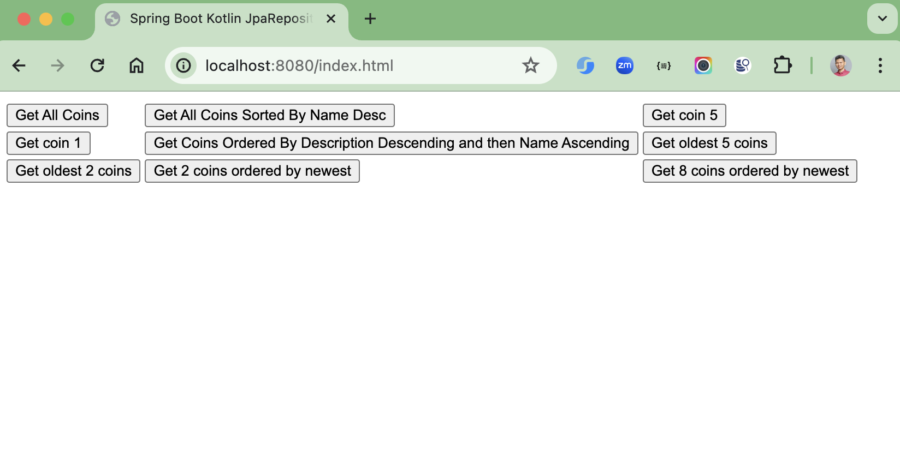
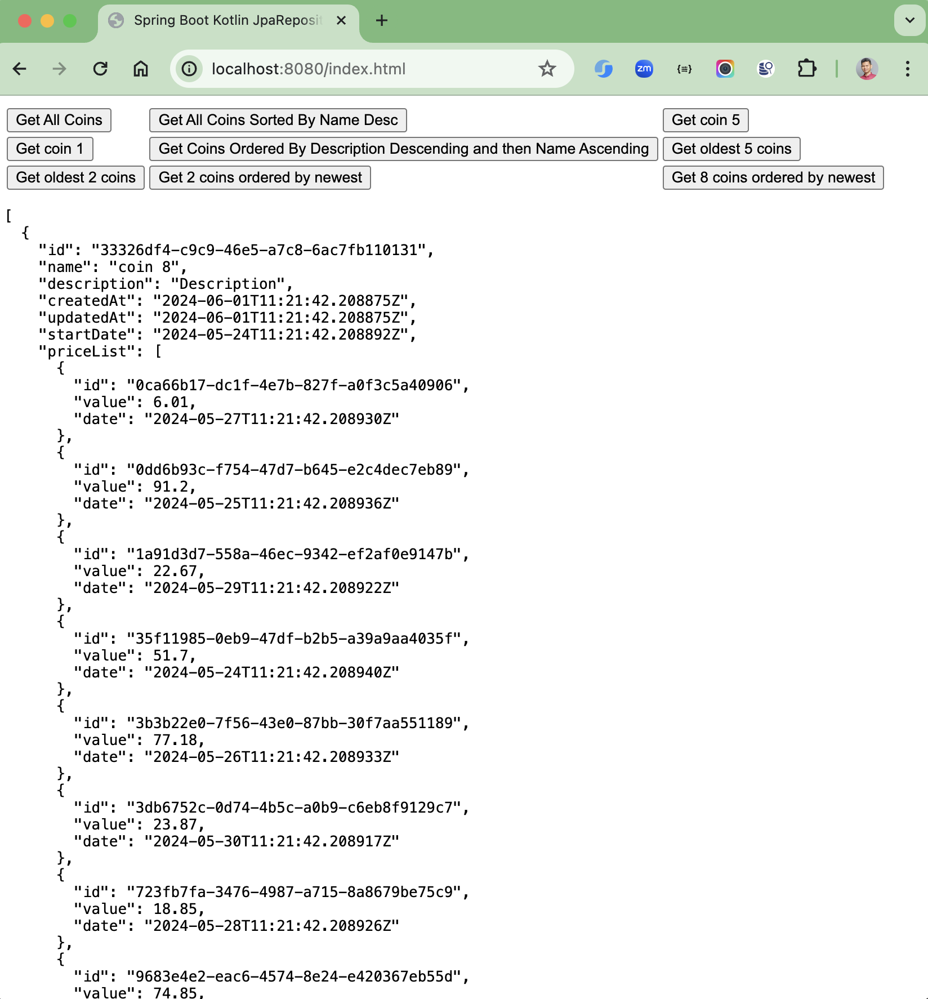

# spring-boot-kotlin-jpa

### Things todo list

1. Clone this repository: `git clone https://github.com/hendisantika/spring-boot-kotlin-jpa.git`
2. Navigate to the folder: `cd spring-boot-kotlin-jpa`
3. Run the application: `gradle clean bootRun`
4. Open your favorite browser: http://localhost:8080/index.html

### Image Screenshot

Index Page

